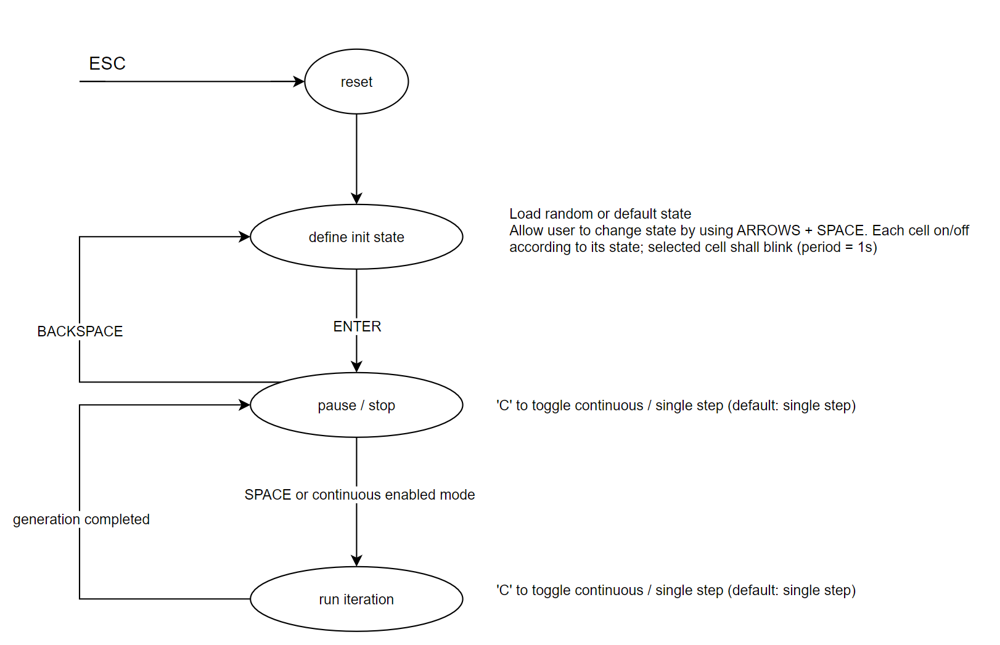

# GameOfLife_VHDL

## Table of contents
<ol>
    <li><a href="#About-The-Project">About the project</a></li>
    <li><a href="#Usage">Usage</a></li>
    <li><a href="#Design">Design</a></li>
    <li><a href="#Contact">Contact</a></li>
    <li><a href="#pending_tasks">Potential updates</a></li>
</ol>

## About the project 

 

This project consists in a VHDL version of Game of Life, which could be considered more of an experiment and was conceived by mathematician John Conway. The main idea is described as follows. There is a bidimensional grid (let's call it the board, the world, the space dimensions) inhabited by cells (each taking one single space unit) that may born, die or keep its state according to the number of alive neighbors at the given moment. For each new generation (minimum time unit, time resolution, Planck's interval, whatever), each cell's fate shall be determined by the following set of simple rules:

* Any live cell with fewer than two live neighbors dies, as if by underpopulation.
* Any live cell with two or three live neighbors lives on to the next generation.
* Any live cell with more than three live neighbors dies, as if by overpopulation.
* Any dead cell with exactly three live neighbors becomes a live cell, as if by reproduction.

The simulation starts with a certain initial distribution defining which cells are lucky enough to begin alive. This opening scenario is the only single point where the user (let's call the observer or even the cells' God?) makes any contribution. After pressing the play button, each cell's state shall depend on its neighbors' state. 

It looks like a really simple game, right? Well, it actually is. One grid, binary elements (cells that can simply live or die, 1 or 0), some basic rules and the relentless course of time. Then, why wasting a simple nanosecond or even a Planck's interval in such a simple system that evolves and runs on its own, leading to cells being born, cells dimming to the void, emerging patterns that propagate along space and time, get stable forever, oscillate or simply disappear? What if our reality and all our surrounding ecosystems are no more than a (way more sophisticated) set of rules that act on a (undoubtedly larger) set of particles, whose fate is totally predetermined since the origin? Was someone or something there at the very beginning deciding which "cells" would be alive when all this began? Can anything emerge from the void? Is our universe discrete as those cells in Game of Life that can only take a specific position in a grid? How can an entire ecosystem co-operate to keep alive, always chasing the universal effort for surviving one step further? Isn't it impressive how genetics evolves from the void to something alive and self-aware or how disease spreads just because of some rules that were coded in virus game instructions? Could consciousness emerge from the void or from anything other than biological matter, such as silicon? Is it possible to predict the future just by looking at any given previous state and trying to assess the rules the system is based on? Do we really have any chance in deciding which way to take when we get to a fork? Are we predetermined, or could we hope that quantum physics will save us from determinism? Does it make sense at all to question all this? Should we feel special as species for being somehow aware of our position in space and time?

Game of Life does not explain any of the previous questions, but isn't it worth questioning them starting from that simple rule-based simulation, even if its complexity is that far away from our reality? Simple things might lead to complex ideas.

Summary: the motivation for this project is much simpler than all the previous biblical text; I have fun programming and learning and I wanted to keep practising my HDL skills while targetting some funny application. But why not a bit of philosophy?

Now you could be about to question if I am in my senses as I have used a Kria KV260 board (a bit over-powered for this task); well, let me justify that: 1) I like reusing my current stuff (small attempt to minimize the amount of electronics components in my drawers) and 2) this was to me an introductory project to get used with Kria KV260 system in terms of programmable logic, pmod, Vivado, logic, constraints... I could have stopped at 3% of this project as I had already worked with Zynq US+ architecture before and only needed to test some basic bitstream and PS (processing system) initialization to check everything was up and running, but I get fun doing this :)

## Usage 

There are three stages:
1) Board initialization
2) Pause
3) Run generation

The program starts at Board initialization.
* At this point, the user can select which cells start alive (represented in white) and which start dead (represented in dark grey). The blinking cell indicates the current position targeted. Arrow keys `UP`/`DOWN`/`LEFT`/`RIGHT` can be used to navigate through the board; `SPACE` can be used to toggle the current cell state.
* `ENTER` shall cause the system to switch to Pause stage.

At Pause stage, the program shall go to Run generation if either `SPACE` is pressed shortly or CONTINUOUS MODE is enabled. If `BACKSPACE` is pressed, the system shall switch to Board initialization stage, keeping the last array distribution selected by the user when the stage was left the last time.

At Run generation, the program shall calculate and update the matrix with the cell distribution corresponding to a new generation based on the previous state and the rules that define the game. Right after, it shall go to Pause stage (going there and back if CONTINUOUS MODE is enabled).

CONTINUOUS MODE can be toggled by pressing `c` at Pause or Run generation stages.

The game behavior is shown in the diagram below:

## HW/SW Design 

Note: this version is an upgrade of [this one](https://github.com/juanma-rm/GameOfLife_VHDL/tree/v1_max7219_and_buttons), where I used a LED array and buttons instead of an external HDMI screen and a USB keyboard.

* HW:
    * AMD/Xilinx Kria KV260 (based on K26 SOM and Zynq Ultrascale+ architecture)
    * HDMI or DisplayPort (DP) external screen, connected to HDMI or DP port in the KV260 board
    * USB keyboard connected to the KV260 board.
* Language: VHDL
* Simulators: GHDL/GTKWave, Modelsim
* Tools: Vivado/Vitis 2022.1 , VSCode + Teros HDL

RTL design / top diagram:  
  

In the ARM Cortex A53 (PS), Ubuntu 22.04 LTS is running and a Pynq/Python -based application takes charge of 1) moving frames generated in the PL to the DP controller (so that we can see the board in the external screen) and 2) attending keyboard events to be sent to the PL to update the cells state.

## Potential updates 

* Randomly generated initial cell distribution

## Contact 

[![LinkedIn][linkedin-shield]][linkedin-url]

(<a href="#top">back to top</a>)

<!-- README built based on this nice template: https://github.com/othneildrew/Best-README-Template -->

<!-- MARKDOWN LINKS & IMAGES -->

[linkedin-shield]: https://img.shields.io/badge/LinkedIn-0077B5?style=for-the-badge&logo=linkedin&logoColor=white
[linkedin-url]: https://www.linkedin.com/in/juan-manuel-reina-mu%C3%B1oz-56329b130/
